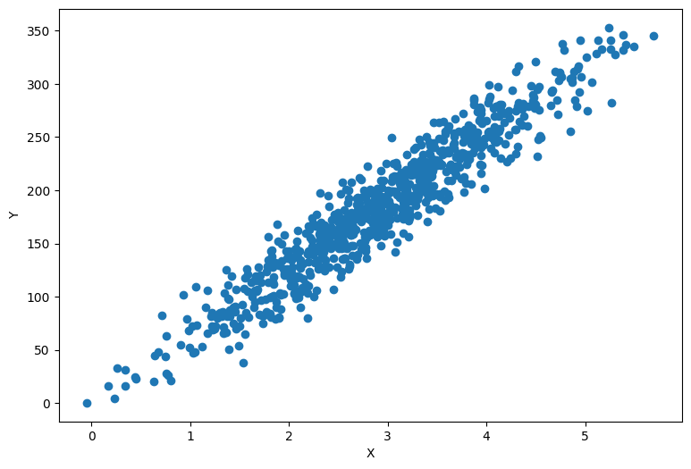
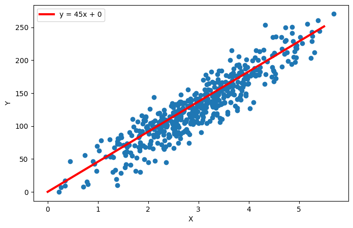
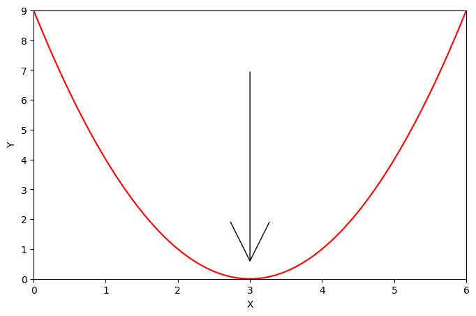
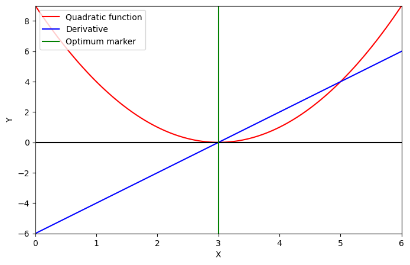
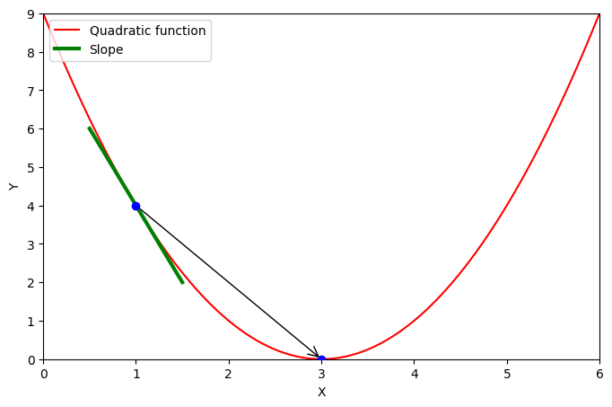
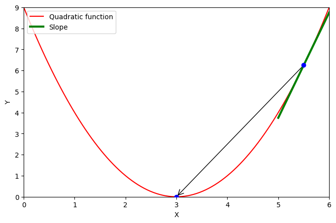
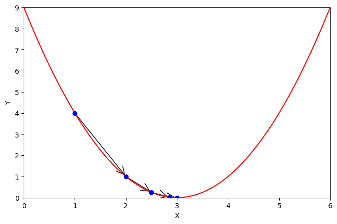

## Understanding Linear Regression
In this article we will try to get a good
understanding of how Linear Regression works and what it is used for. More
specifically, we will try to predict the prices of properties in the Delhi
region. The dataset that we are going to be working with can be found
[here](https://www.kaggle.com/code/ashydv/housing-price-prediction-linear-regression/data).
It contains multiple features like area, number of bedrooms, number of bathrooms
and so on, that could contain valuable information for our model. For the sake
of simplicity we will try to predict a properties price just from its area.

 

## What does Linear Regression do?
Well just as we said above, we want to make an accurate prediction for what the price of
a house should be, given its area.
Linear Regression builds a model/function that is continous, meaning we can put in any possible value that we can think of 
and it will give us a result.
Obviously the result may not make sence in every case, so for
example when our model only ever saw data in the range from 1 to 1.000 it probably
won't produce great results for a value of 10.000.

A possible solution for our regression problem could look like this:

 

In the image you can still see our data, but now
we added whats called a regression line or just
a linear equation you might know and hate from school.
But don't worry we'll make it cool.

The equation for this specific regression line is:

$$
\hat{y} = 45x + 0
$$
The `+ 0` part means that at `x = 0` y will
also equal 0. Just plug in 0 for x and you will
see it for yourself.
The `45x` part means that for every step to the
right we take 45 steps uppwards, so for `x = 2`
y will equal 90.

The generalized form of our equation goes as
follows:

$$
\begin{align}
\hat{y} = mx + b
\end{align}
$$
We will call this equation "eq. 1" as indicated
on the right.

Here are some more example regression lines with
their formula to make it as clear as possible.

 
 

Got it? Good! Let's move on.

## How do we know which is the best line for our data?

To know which of the many possible lines is the
best one for our dataset we need some kind
of score for every line and then we just take
the highest scoring line.
Or what we will do is calculate how bad each 
line is and then take the least bad one.

Let's pretend our dataset only contains 4 datapoints
like the table below. Note that $\hat{y}$ is what
our line equation would prdict for that rows `x` value
and y is the actual true value. In this our line equation
is: $\hat{y} = 2x + 10$.
| $i$  | $x$  | $y$   | $\hat{y}$
|----- | ---- | ----- | ---- |
| 0    | 10   | 28    | 30   |
| 1    | 11   | 27    | 32   |
| 2    | 20   | 46    | 50   |
| 3    | 30   | 73    | 70   |

What we can do now is just take the difference
of $y$ and $\hat{y}$ for each point and sum each
example:
$$
Error = \sum_{i=0}^{4} (\hat{y_i} - y_i) = (30 - 28) + (32 - 27) + (50 - 46) + (70 - 73) = 2 + 5 + 4 - 3 = 8
$$

 

Notice that we have 2 problems here:

1. The last datapoint (i=3) seems to decrease the "error"
of our model, which is not what we want
2. If we add more examples the "error" should, as long
as our line is not perfect, become really big/small,
since we just add everything together.

However these are easy fixes:

1. Insead of just summing the differences
we can sum the absolute/squared values of differences:

$$
\begin{align*}
Error &= \sum_{i=0}^{4} |\hat{y_i} - y_i| \\ &= |30 - 28| + |32 - 27| + |50 - 46| + |70 - 73| \\ &= 2 + 5 + 4 + 3 = 14
\end{align*}
$$
or
$$
\begin{align*}
Error &= \sum_{i=0}^{4} (\hat{y_i} - y_i)^2 \\ &= (30 - 28)^2 + (32 - 27)^2 + (50 - 46)^2 + (70 - 73)^2 \\ &= 4 + 25 + 16 + 9 = 54
\end{align*}
$$
This way every single example always has a possitive "error", 
because $|-2| = 2$ and $(-2)^2 = 4$.
That way they don't make the result better even though they
are not good.
The intuition behind squaring is that we punish small "errors"
less (ex. $0.5^2 = 0.25$) and big "errors" more
(ex. $5^2 = 25$).

2. Instead of summing we can take the mean to reflect how
wrong the average prediction is:
$$
Error = \mathbf{\frac{1}{n}}\sum_{i=0}^{4} (\hat{y_i} - y_i)^2 = \frac{54}{4} =  13.5 
$$
This is function is called Mean Squared Error or MSE. "Take the mean
of squared errors".

Generalizing we get formula 2:

$$
\begin{equation}
Error = \frac{1}{n} \sum_{i=0}^{n} (\hat{y_i} - y_i)^2 
\end{equation}
$$
where:
- $\theta$ is our final error
- $n$ is the number of examples we have in our dataset.
In our little example that was 4.
- $\hat{y_i}$ is what our line equation 
predicts for the i*th* example.
- $y_i$ is the actual true value of that datapoint in
our dataset.
- the $\sum_{i=0}^{n}$ sign means we do everything
in the braces n times and then sum the results. At the first iteration
$i=0$ at the second iteration $i=1$ and so on up to $i=n-1$.
It's basically a non-inclusive range for the upper end.

## How can we make our "error" smaller?

Now that we have our Error function we need to
figure out to make that value smaller.
The MSE (Mean Squared Error) function looks
something like this:

 

As we can see the value is smallest in the middle,
so that's where we want to go.

At this point you might remember that if you
derrive a function the resulting function
will give you the slope of the original
function at that point.

This function and it's first order derivative
look like this:

 

The derivative function takes on a negative value
on the left and a positive value on the right
of the green line.
That means that the original function falls on the
left and rises on the right of that same line.

We can therefore derive(;D) that if our derivative is negative
we want to move to the right because the 
error function and thus the error is smaller there:

 

And if our derivative is positive we want to move
to the left since the error function is smaller in that
direction:

 

In our the examples above we can clearly see how far
we have to move to the left or to the right.
In reality we ofter don't know how the function looks,
so we have to make "guesses" about how far we move
to either direction.

The simples version of this methodology is to make the
distance we travel dependent on the solpe of the function,
meaning that if the slope is high we assume, that we are
further away from the optimum and we take a bigger step.
At the same time if the slope is really smal we only
take a small jump because we think that we are already
pretty close to the perfect point.

An example of how this might look below:

 

To be able to perform a single step like the one above
we have to know the derivative.
I will not show you how to derive the MSE. If you want
to do it you can try yourself. Otherwise just take my
word for it.

$$
\begin{align*}
\theta_m &= \frac{\partial}{\partial x}
\frac{1}{n} \sum_{i=0}^{n} (\hat{y_i} - y_i)^2 \\
&= \frac{2}{n} \sum_{i=0}^{n} (\hat{y_i} - y_i)x_i
\end{align*}
$$
In case you are wondering, $\frac{\partial}{\partial x}$
means taking the partial derivative with respect to x
but you can just ignore that line if you don't want to get
into it. It is not essential to know this to continue
with the series.
As you can see we introduced a factore of two in the
fraction ($\frac{2}{n}$) this is often ignored,
because of the way we use this function, so the factor
is not relevant to us and we can control it with
a different variable.
Because of that our function becomes:

$$
\begin{align}
\theta_m = \frac{1}{n} \sum_{i=0}^{n} (\hat{y_i} - y_i)x_i
\end{align}
$$

Notice how $x_i$ is now a part of our error as well, because we
are calculating how to change our $m$.
How ever we also need to change our $b$ so the function to adjust $b$
is:

$$
\begin{align}
\theta_b = \frac{1}{n} \sum_{i=0}^{n} (\hat{y_i} - y_i)
\end{align}
$$

There is only one small piece missing now: 
Adjusting $m$ and $b$.

$$
\begin{align}
m &= m - \alpha \theta_m \\
b &= b - \alpha \theta_b
\end{align}
$$

$\alpha$ here is what is called a hyperparameter,
that desides how much we change $m$ and $b$ at ones.
We will not cover how to choose $\alpha$ in this article
and just set it to $0.1$. We will how ever look into
it more closely in later on in this series.

### Putting it together

1. Start with random $m$ and $b$ in eq. (1)
2. Take dataset and calculate all the 
$\hat{y}$ using eq. (1) 
3. Calculate $\theta_m$ and $\theta_b$ with eq.(3) and eq.(4)
4. Adjust $m$ and $b$ using eq.(5) and eq.(6)
5. Repeat 2nd, 3rd and 4th until your are satisfied with the result

That's it we know covered what Linear Regression is,
what it is used for and how it works.
In the next part of this series we will implement
our primitive algorithm in python and try it out.
After that we will dive in a bit deeper into
optimizations and tuning to make our algorithm work
better.
