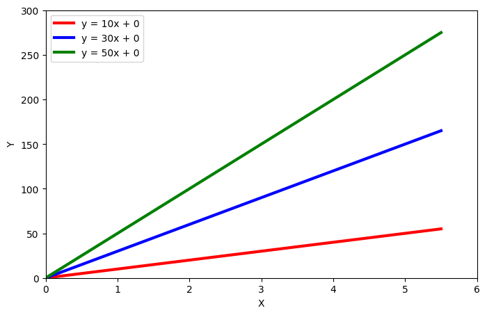
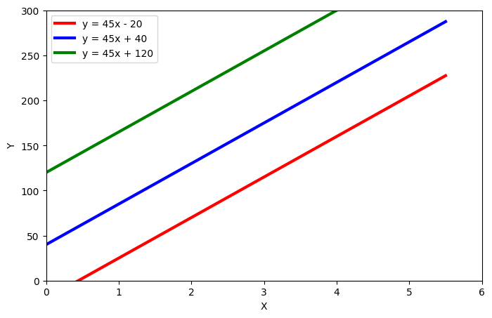
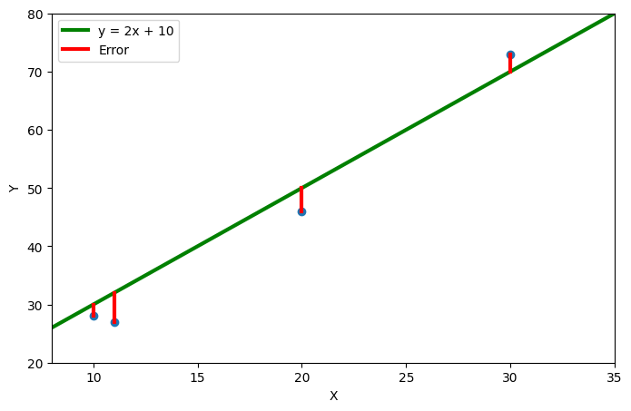

## Understanding Linear Regression

Welcome to our series on understanding Linear
Regression from scratch! In this series,
we will explore the concept of linear regression,
a powerful statistical and machine learning 
tool that forms the basis for many complex models.
We'll start by discussing the fundamental
concepts of linear regression and providing 
an intuitive understanding. Then, through 
some practical examples, we'll move on to
developing and optimizing Linear Regression 
models in Python. Finally, we'll branch out into 
more advanced topics and applications. So 
join us on this journey of understanding and
learning Linear Regression!

## What does Linear Regression do?

Linear regression is used to predict an outcome given a set of independent variables by drawing a best-fit line, or "regression line" through the data points. The goal is to use this line to make predictions about a dependent variable based on the independent variables. It is a widely used and powerful tool for predicting values in fields such as finance, economics, and engineering.

 

A regression line is formed by plotting a linear equation,
determined by the values of the slope (m) and the y-intercept
(b) of the line, through a series of data. For example, if 
the slope of a regression line is 45 and the y-intercept
is 0, each point along the line can be determined by the
equation $\hat{y} = 45x + 0$; this implies that for every step
we take to the right along the x-axis, we take 45 steps
upwards along the y-axis, thus when x = 2, y will equal 90.

The generalized form of our equation becomes:

$$
\begin{align}
\hat{y} = mx + b
\end{align}
$$

This equation will be referenced in the future as "Equation 1" or just "(1)".

In case the idea is not 100% clear yet here are some examples:

 
 

Now that we have a better understanding of what it does, let's move on.

## How do we detaimain the best line for our data?

In order to determine which line is best for our dataset,
we need to assess the performance of each line.
We can do this by calculating how bad the line is.
To illustrate, let's pretend that our dataset only 
contains 4 data points, as shown in the table below.
For these data points, the line equation is 
$\hat{y} = 2x + 10$. The column $\hat{y}$ contains
the values our line equation would predict for each 
x value, while the column y contains the actual true
value. We can assess the performance of each line by
calculating how bad our predictions are. The line 
with the lowest badness score will be our best-fit line.

| $i$  | $x$  | $y$   | $\hat{y}$
|----- | ---- | ----- | ---- |
| 0    | 10   | 28    | 30   |
| 1    | 11   | 27    | 32   |
| 2    | 20   | 46    | 50   |
| 3    | 30   | 73    | 70   |

What we can do now is just take the difference
of $y$ and $\hat{y}$ for each point and sum each
example:

 

$$
Error = \sum_{i=0}^{n} (\hat{y_i} - y_i) = (30 - 28) + (32 - 27) + (50 - 46) + (70 - 73) = 2 + 5 + 4 - 3 = 8
$$
where:
- $n$ is the number of examples we have in our dataset.
In our little example that was 4.
- $y_i$ is the actual true value of the i*th* data point.
- $\hat{y_i}$ is what our line equation
predicts for the i*th* example.
- the $\sum_{i=0}^{n}$ sign means we do everything
in the braces n times and then sum the results. At the first iteration
$i=0$ at the second iteration $i=1$ and so on up to $i=n-1$.
It's basically a non-inclusive range for the upper end.

In plain text we take $\hat{y_0}$(30), subtract $y_0$(28) and repeate for $y_1$, $y_2$, $y_3$,
then sum the results and devide by the number of examples.

Notice that we have 2 problems here:

1. The last datapoint (i=3) seems to decrease the "error"
of our model, which is not what we want
2. If we add more examples the "error" should, as long
as our line is not perfect, become really big/small,
since we just sum everything together.

However these are easy fixes:

1. Insead of just summing the differences
we can sum the absolute/squared values of differences:

$$
\begin{align*}
Error &= \sum_{i=0}^{4} \mathbf{|}\hat{y_i} - y_i\mathbf{|} \\ &= |30 - 28| + |32 - 27| + |50 - 46| + |70 - 73| \\ &= 2 + 5 + 4 + 3 = 14
\end{align*}
$$
or
$$
\begin{align*}
Error &= \sum_{i=0}^{4} (\hat{y_i} - y_i)^{\mathbf{2}} \\ &= (30 - 28)^2 + (32 - 27)^2 + (50 - 46)^2 + (70 - 73)^2 \\ &= 4 + 25 + 16 + 9 = 54
\end{align*}
$$
This way every single example always has a possitive "error",
because $|-2| = 2$ and $(-2)^2 = 4$.
That way they don't make the result better even though they
are not good.
The intuition behind squaring is that we punish small "errors"
less (ex. $0.5^2 = 0.25$) and big "errors" more
(ex. $5^2 = 25$).

2. Instead of summing we can take the mean to reflect how
wrong the average prediction is:
$$
Error = \mathbf{\frac{1}{n}}\sum_{i=0}^{4} (\hat{y_i} - y_i)^2 = \frac{54}{4} =  13.5
$$
This is function is called Mean Squared Error or MSE. "Take the mean
of squared errors".

By generalizing, we get Equation 2:

$$
\begin{equation}
Error = \frac{1}{n} \sum_{i=0}^{n} (\hat{y_i} - y_i)^2
\end{equation}
$$

Now we know what to reduce!

## How can we make our "error" smaller?

Now that we have our Error function we need to
figure out to make that value smaller.
The MSE (Mean Squared Error) function looks
something like this:

As we can see the value is smallest in the middle,
so that's where we want to go.
You might also recognize that the slope of the function
is 0 at that point, which makes sence because if there where
positive or negative slope either going to the left or right
would yield in a lower value of the function.
That means if we want to find the minimum of a function
we want to find the point where it has no slope.

At this point you might remember that if you
derrive a function the resulting function
will give you the slope of the original
function at that point.
So if we then find the point at which the
derivative is equal to 0 we found our minimum.
If all that doesn't make any sence to you then
don't worry. It is not neccessary to continue,
you just need to trust that what I'm saying is
true ;D.

The quadratic function and it's first order derivative
look like this:

The derivative function takes on a negative value
on the left and a positive value on the right
of the green line.
That means that the original function falls on the
left and rises on the right of that same line.

We can therefore derive(;D) that if our derivative is negative
we want to move to the right because the
error function and thus the error is smaller there:

And if our derivative is positive we want to move
to the left since the error function is smaller in that
direction:

In our the examples above we can clearly see how far
we have to move to the left or to the right.
In reality we ofter don't know how the function looks,
so we have to make "guesses" about how far we move
to either direction.

The simples version of this methodology is to make the
distance we travel dependent on the solpe of the function,
meaning that if the slope is high we assume, that we are
further away from the optimum and we take a bigger step.
At the same time if the slope is really smal we only
take a small jump because we think that we are already
pretty close to the perfect point.

An example of how this might look below:

To be able to perform a single step like the one above
we have to know the derivative.
I will not show you how to derive the MSE. If you want
to do it you can try yourself. Otherwise just take my
word for it.

$$
\begin{align*}
\theta_m &= \frac{\partial}{\partial x}
\frac{1}{n} \sum_{i=0}^{n} (\hat{y_i} - y_i)^2 \\
&= \frac{2}{n} \sum_{i=0}^{n} (\hat{y_i} - y_i)x_i
\end{align*}
$$
In case you are wondering, $\frac{\partial}{\partial x}$
means taking the partial derivative with respect to x
but you can just ignore that line if you don't want to get
into it. It is not essential to know this to continue
with the series.
As you can see we introduced a factore of two in the
fraction ($\frac{2}{n}$) this is often ignored,
because of the way we use this function, so the factor
is not relevant to us and we can control it with
a different variable.
Because of that our function becomes:

$$
\begin{align}
\theta_m = \frac{1}{n} \sum_{i=0}^{n} (\hat{y_i} - y_i)x_i
\end{align}
$$

Notice how $x_i$ is now a part of our error as well, because we
are calculating how to change our $m$ is the factor for x, see in (1).
How ever we also need to change our $b$ so the function to adjust $b$
is:

$$
\begin{align}
\theta_b = \frac{1}{n} \sum_{i=0}^{n} (\hat{y_i} - y_i)
\end{align}
$$

There is only one small piece missing now:
Adjusting $m$ and $b$.

$$
\begin{align}
m &= m - \alpha \theta_m \\
b &= b - \alpha \theta_b
\end{align}
$$

$\alpha$ here is what is called a hyperparameter,
that desides how much we change $m$ and $b$ at ones.
We will not cover how to choose $\alpha$ in this article
and just set it to a smal value like $0.1$. We will how ever look into
it more closely in later on in this series. Because setting $\alpha$
correctly is essential to get decent results.

### Putting it together

1. Start with random $m$ and $b$ in eq. (1)
2. Take dataset and calculate all the
$\hat{y}$ using eq. (1)
3. Calculate $\theta_m$ and $\theta_b$ with eq.(3) and eq.(4)
4. Adjust $m$ and $b$ using eq.(5) and eq.(6)
5. Repeat 2nd, 3rd and 4th until your are satisfied with the result

That's it we now covered what Linear Regression is,
what it is used for and how it works.
In the next part of this series we will implement
our primitive algorithm in python and try it out.
After that we will dive in a bit deeper into
optimizations and tuning to make our algorithm work
better.

